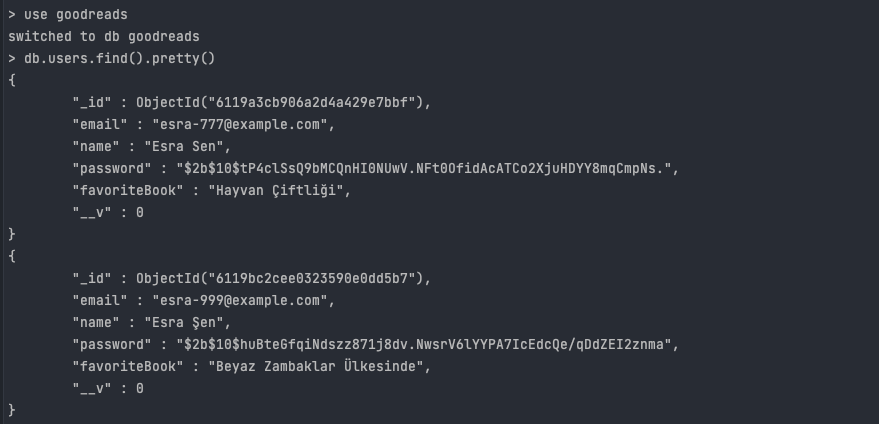
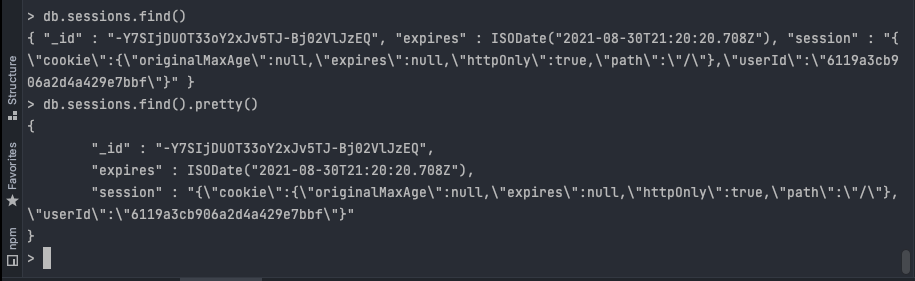

# Example of a user authentication system that controls users access to web resources using Node.js Express and MongoDB

***Screenshots from mongo shell***
:camera_flash:

***Used BCrypt node package to hashing user passwords***

